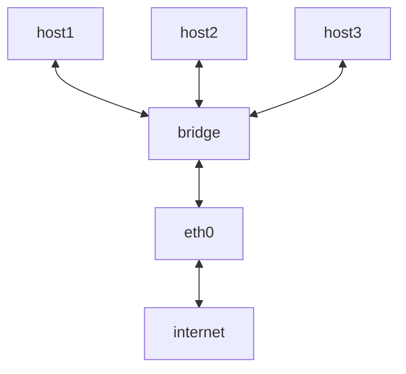
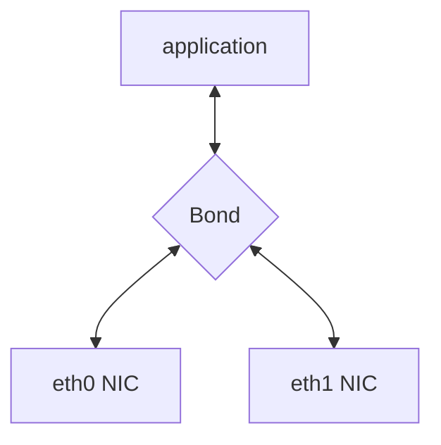

# Overview of linux networking

## Links:

1. https://developers.redhat.com/blog/2018/10/22/introduction-to-linux-interfaces-for-virtual-networking#

2. https://developers.redhat.com/blog/2019/05/17/an-introduction-to-linux-virtual-interfaces-tunnels

## Layers

### KERNEL SPACE

1. The Physical Layer: Sending computer bits between devices, setting up physical connections, transmission method (electric, optic, radio). Hardware.
2. The Data Link Layer: Establishes/terminates connections. Breaks up packets into frames. Adds source+destination. Error checking. Throttling.
3. The Network Layer: Breaks up/reassembles segments into network packets. Best physical path discovery via addresses.
4. The Transport Layer: Transmission protocols (TCP, UDP,..). Delivery and error checking of data packets. Regulates size, sequencing, and ultimately the transfer of data between systems and hosts. Establishes connection, acknowledges the receipt of packets, and resend packets that aren't received or are corrupted.

### USER SPACE

5. The Session Layer: Maintains connections (keep alive) and
6. The Presentation Layer: Format, and encryption.
7. The Application Layer: Run in applications to send data.

## STP

Spanning Tree Protocol - removes loops in paths but telling which paths are allowed. Trims the tree.

## VLAN Filter

Restrict communication based on,

1. MAC address
1. Protocol
1. IP Address ...

## Multicast

Send a single packet to multiple hosts
using a multicast MAC address

## IGMP snooping (multicast)

Listen to IGMP traffic.

## Bridge

1. Like a network switch.
1. Forwards packages between interfaces.
1. Used for gateways, VMs and network namespaces.
1. STP, VLAN filter, multicast snooping.

A bridge is used to route packets on the way back to their origin.

## Bonded interface

Take multiple interface, and make into one. In modes,

1. hot-standby
1. load balancing

This would increase the speed, or create failover.

## Team interface

Like bonded interface, groups NICs together. But supporting more features. Namely,

1. LACP
1. D-BUS interface (middleware)
1. etc..

## VLAN

A virutal LAN network.

1. Group hosts between switches (within the same network)
1. Adds tags to network packets.
1. Has its own IP address.

## VXLAN

Extended protocol of VLAN, and used in data centers. Provides more network identifiers to allow more hosts to join.

## MACVLAN

Same as VLAN, but using the mac address. Difference is that you dont need a bridge to connect to NICs

5 types,

1. Private - no comms between nodes.
1. VEPA - Everything stransffered through NIC
1. Bridge - all endpoints connect.
1. Passthrough - just one endpoint.
1. Source - filter traffic.

## IPVLAN

Similar to macvlan - endpoints have the same mac address.

## MACVTAP/IPVTAP

Auto creates a Tun/TAP device associated with the interface.

## MACsec

MACsec (Media Access Control Security). Adds an encrypted header? Secure all messages.

## VETH

Virtual Ethernet - local ethernet tunnel. Used to communicate between isolated network namespaces (Like a docker NETWORK)

## VCAN

Virtual CAN, similar to loopback devices, receive CAN messages - used in automotive industry.

## VXCAN

Similar to VETH, CAN traffic tunnel to VCAN devices.

## IPOIB

IP-over-InfiniBand protocol. For infiniband connections. -> to use infinity band as NIC.

## NLMON

Netlink monitor device. Monitor Netlink messages.

Netlink is used to transfer information between the kernel and user-space processes.

## Dummy interface

Lookback interface for example. All virtual. Route packets without transmitting them.

## IFB - Intermediate Functional Block

Use an IFB interface when you want to queue and shape incoming traffic.

## netdevsim

Simulated networking device - used for testing.

## Tunnel

Network tunneling is a method of transporting data across a public network using protocols that the network doesn't support. (UDP over TCP:)?

Wraps packet inside other packets.

## IPIP Tunnel

IP over IP tunnel,

1. Used to connect two subnets.
1. Can only send unicast traffic.
1. Lowest overhead.
1. Add packet header.

-> basically, tunnel two ips.

## SIT Tunnel

Simple Internet Transition, Like IPIP and includes it, support IPV6 MPL and any (accepts bother ipv6 and ipv4)

## ip6tnl Tunnel

ip6tnl is an IPv4/IPv6 over IPv6 tunnel interface, which looks like an IPv6 version of the SIT tunnel

## VTI and VTI6

Virtual Tunnel Interface, secure tunnel implemenation. Operate same asn ipip or si, except they add security.

## GRE and GRETAP

Generic Routing Encapsulation, also known as GRE. Any layer 3 protocol

## FOU - Foo Over UDP

This is in the transport layer. Tunnel there

## GUE

Generic UDP Encapsulation - UDP tunneling - has its own encapsulation header, which contains the protocol info and other data

## GENEVE

Generic Network Virtualization Encapsulation. Supports all capabilities of,

1. VXLAN
1. NVGRE
1. STT

## ERSPAN and IP6ERSPAN

Encapsulated Remote Switched Port Analyzer. uses GRE encapsulation to extend the basic port mirroring capability from Layer 2 to Layer 3 (up a layer for the tunneling)
