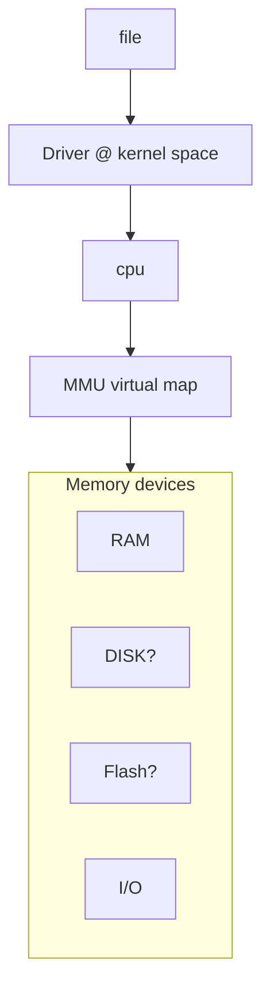

# What is linux?

Linux is an operation system written (Linus), based on the then popular unix. The linux system is composed of,

1. Kernal, which
   1. Manages CPU (What program is running on which cpu now, context switch)
   1. Manages Memory (MMU, Virtual Memory)
   1. Manages IO devices (hardware, Disks/Sockets/Inputs/Network)
   1. Manages resources (hardware -> processes)
   1. Runs software, and manages applications
   1. Supports application via system calls,
      - process control (exec, fork, exit, wait, getpid, ..)
      - file (open, read, write, close)
      - network (socket, bind, listen, accept, connect, send, recv)
      - device (ioctl, mmap)
      - device drivers (In kernal space, via modules, Block (video) or Char (keyboard))
      -

# Notes on device drivers

1. You can run device drivers in user space. But in general they would run in kernal space (with proper permissions)
1. OS provides infra. to write and run device drivers; cdev_add, cdev_init... etc.
1. Usually represented as a file -> maps to driver -> read + write.
1. Applications use the file read/write to interact with the device.
1. keyboard/mouse are char drivers.
1. video is a block driver. Both are files.
1. kernel talks to devices for example
   - BUS: a stream of information, in and out.
   - Memory mapping: memory block is mapped to the device. (e.g. a list of 1/0 pins or some known memory size mapping)
1. Abstractions
   - Frameworks - type of device and class is standardized. (GPIOLIB)
   - Buses - Device is abstracted away from driver (I2C, USB core, PCI ..)

