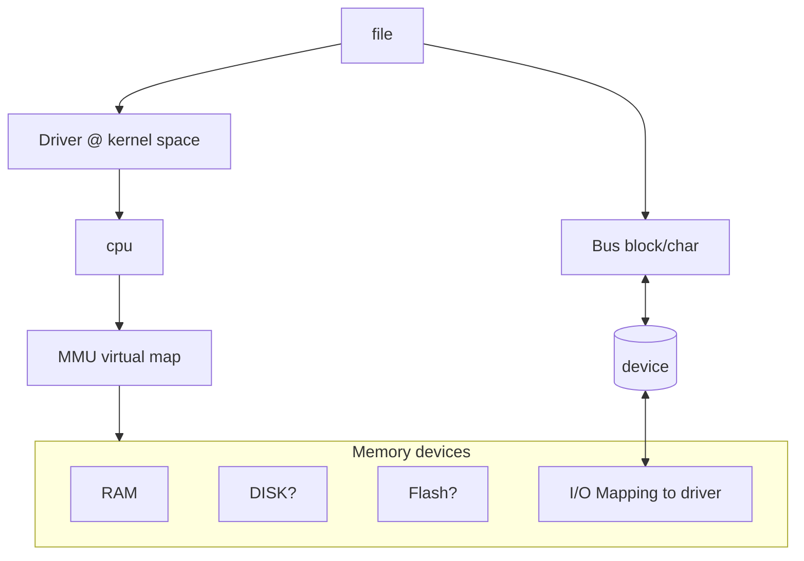

# Device drivers

1. Usually in /dev (not network-devices)
1. You can run device drivers in user space. But in general they would run in kernal space (with proper permissions)
1. OS provides infra. to write and run device drivers; cdev_add, cdev_init... etc.
1. Usually represented as a file -> maps to driver -> read + write.
1. Applications use the file read/write to interact with the device.
1. keyboard/mouse are char drivers.
1. video is a block driver. Both are files.
1. kernel talks to devices for example
   - BUS: a stream of information, in and out.
   - Memory mapping: memory block is mapped to the device. (e.g. a list of 1/0 pins or some known memory size mapping)
   - Network devices:
1. Abstractions
   - Frameworks - type of device and class is standardized. (GPIOLIB)
   - Buses - Device is abstracted away from driver (I2C, USB core, PCI ..)

## Notes on network device drivers and adapters

1. Network devices are not in /dev
1. They can be in /dev, but dont usually fit the model of read/write.
1. You can find em in /proc/net/dev or /sys/class/net
1. /tap or /tub is virtual network resources which are used for tunneling.
1. Interaction is done via ioctl

For binding devices we have to types,

1. raw sockets.
1. packet sockets.

Up on these there are implemented standard network protocols,
