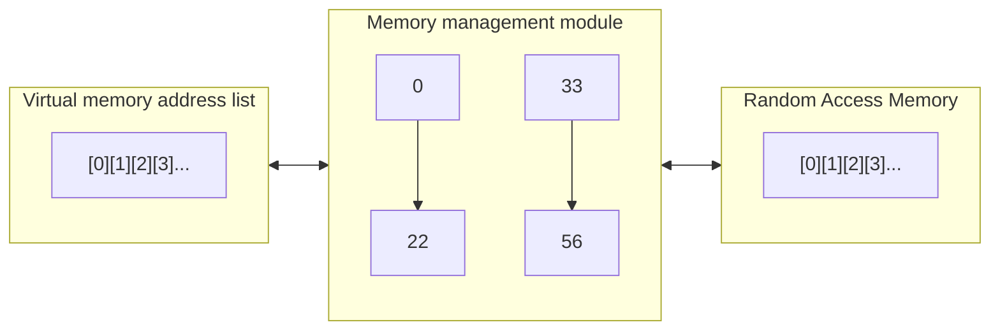

# What is virtual memory

Virtual memory is a mapping between an address space to an underlying physical device (or None). Where an address space is a collection of numbers that represent where each bit of the program will be stored.

If the virtual memory technique we have,

1. Address space an mapping in Virtual Space
1. Address space an mapping on devices (RAM)

The MMU (Memory management module) negotiates the two. The virtual memory can be mapped to,

1. RAM
1. SWAP
1. Device (GPIO... etc) (Change in bit in one, will cause a change in bit in the other)

## The Virtual Memory translation

Assume we have only RAM, our mapping will be,

The virtual memory is the range of addresses to be mapped. The mapping is done by hardware, called the MMU. (Some processors don't have these, but can still run linux)

When a program runs.

1. Is allocated a range in the virtual memory. Where it would have its bits.
1. Once a memory address is requested, its assigned a location in the physical memory.
1. When an app wants to store a bit, the kernel/MMU translates the location and stores the bit.

The virtual memory range is much larger then the actual memory (physical)

## SWAP

SWAP is a way to store some of the RAM memory on disk. That is once the kernel notices that memory availability is low, it will download some of the address locations in the virtual memory to disk (Algo, LRU) and keep a map of that. Then free that physical memory for use. If a program needs to run with that memory, then a page fault error occurs in the MMU, which traps execution until the kernel loads that memory from disk.
