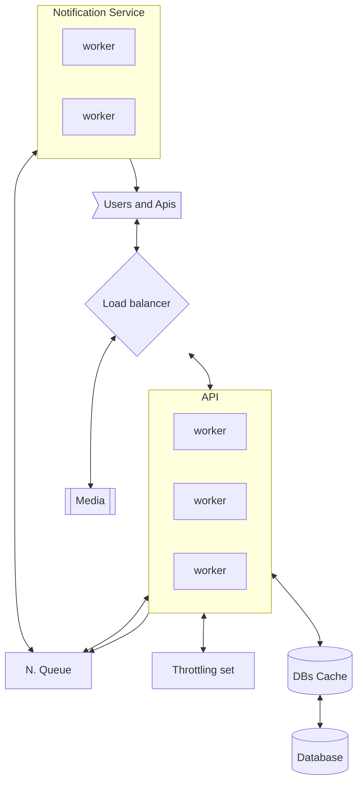

# Topic

A chat app is one that allows a producer (user, service) to send messages of,

1. Text
1. Media
1. Voice, Video, ..

To a user.

A producer can send messages to either,

1. A single user
1. A group of users

## Questions about scope and requirements

1. Who is using the service? Users, Apis
1. What type of messages are they sending? (See above)
1. Any other services we should be providing? On-line indicator. End-To-End encryption in future.
1. What is the expectation from the user? - message will appear in the other users group, as fast as possible. Actually immediate.
1. Traffic? How many messages are sent? The website should support 50M active users per day.
1. How many users per group? can that be infinite? 100 max. But can you support infinite.
1. Can users send messages to each other directly? Is that blocked or allowed? Allowed.
1. What is the size of a message? Dose it contain other media? Max 10K chars. May contain other media.
1. Do we need to store the messages for posterity? Or once message is passed we can remove it? Sore messages forever.
1. What it the latency expectation? - as fast as possible
1. What are the operations the api can do?
   - send(message, user)
   - get messages(grp/user) (history)
   - get status (users)
1. Cap
   - Consistency - yea, all messages should be delivered, eventually.
   - Availability - the service should be always available.
   - Partitioning - the service should be fault tolerant against server down and network down.
     e.g. `AP`
1. Limitations? Hardware? Software (use existing if possible)? People? - None.

# Example

A user "Alice" wants to send a message to group "Grp" that includes bob. She writes the the text in her app, that then send the message to the api.

At the same time a user "Charlie" is also sending a message. "Charlie" sent first.

All users, are able to see all messages in the group "grp" according to the order they were sent. Even if some messages are received before others.

Two years later, "Alice" wants to recall the conversation she had with grp. She loads the grp messages and can see what messages were there.

# High level design, and other considerations

## Our goal

To create a service that allows,

1. Keep user information and status.
1. Send messages to users and groups.
1. Keep message storage, and allow messages to be pulled from there.
1. Recall messages from a group or users.

For now we will ignore other media since we can always create a media service and refer to that service once we have the message metadata and group metadata.

We can also ignore direct messaging from user to user, and end-to-end encryption. Though this can be generated in the future by public/private keys. Considerations should be made if the server/application service can read the messages.

## Definitions

**user** - a user or service that can receive or send messages.
**grp** - a group of consumers.

## Calculations and estimations

### Data

We need to know how much data we should expect. Lets estimate the number of messages sent from the users. Since we have 50M DAU, at max, we can expect users to send a message a second. We can consider that our throttling.

We have 50M users, so the max per second is 50M*10k -- very very large traffic size. ~ 50e6*10e4 =5e10--> 50TB per second. This is a lot of data. And would be the peak usage. For now we would note that the system would not handle this, since its a vary rare edge case - we do not expect all users to write at the same time.

Instead, we should take into account the expected traffic size. Most users would write on average 100 msg\*10kb=1Mb messages per day. Which would mean that for the 12 waking hours or so the expected traffic would be, 50M\*1E6/12/3600 ~=1GB/second. This is a much more addressable number though we would expect to be less than this.

Since every message could result in sending 100 messages to other users, or at least a changed notifications on channels, we would expect at max, 1TB per second output traffic. That said, the change notifications can be grouped together so we can reduce this traffic. Instead of sending each message to the user, we can group the message notifications for the user and allow the users, to download the appropriate messages at a lower pace. This would reduce the traffic to 50M\*10k per second max, if all users want to update at the same time. If this happens we can afford to be slower.

For storage, we only store the incoming data, and therefore would expect, 100 messages per day per 50M users, 10kb per message, 50e6*1e4*1e2 = 5e12 -- 5Tb of data per day. Very doable. Or 256\*5 = 1.3 or so PB per year for messages alone. With media, this can get much higher so the media servers would need to have a limitation per user, or allow for much slower response and search. We would need to consider a slower approach for archived and old data.

1. Throttling - 10 messages for 10 seconds per user. Token bucket.
1. Traffic - 1Gb/second in, max 5Tb/s out (if updated every second).
1. Storage - 5TB/day, or 1.3 PT per year.

## Load

We have 3 load locations,

1. The message send api.
1. the database
1. The message notification api.

## Hotspots

Since some grps may have many users, we would expect that many users may pull the grp data from the database, for this it would be better to implement some cache system - we care about eventual consistency and therefore would be ok in the case of a hotspot taking more time to update.

### Send api

This api recives messages from users, and would grow with the api itself. Note that we may want to add rules to this api, which can affect load. But in general this api can grow linearly with the active users.

### Database

For storing data we can definitely implement an eventual store method. This would reduce the load from the database and allow us to return the request fast to the user. Still, the load here, is as high as the send api.

We would need to add some cache methods for message update, since this would reduce the cost of repeated calls for update.

### Notification api

We can try an actively send all messages for a specific user, via a worker. But this is not very efficient,

1. The user is not online and the app is not listening,
1. The user has many apps open - which will connect to the same feeds.

In this case, we can store per user, per channel, what is the last updated timestamp. This allowing us to reduce the load on the message processing workers.

## Data structure

Message,

- ts
- groups(s) (a user target is a group with the user name)
- user
- metadata
- text
- links to media

Group

- users
- metadata

User

- status
- metadata
- groups status

# So far

1. We have realized that we will be storing lots of data
1. We realized that we need to minimize the update size for the user, otherwise well have lots of outgoing traffic, which is much.
1. We realized that we need to throttle the user, and this should be ok for most users. Other apis may need bigger throttling.

# Design

System parts,

1. Media storage service - to store other media, external, can be slow.
1. Message, Group and User database
1. Database cache
1. API service
1. Change notification service
1. User notification Queue. (Redis?)

## Pull vs Push

This is a push implementation, where the system notifies the user on changes. This would mean that the user receive a notification of change, which is actively sent by the server. This method is very good for fast delivery but is resource heavy on the server side.

One can imagine that bz groups may use a pull method, where when the user asks for updates, it will load the changes in these specific grps. In that case, we can imaging a increase dt model for pulls from last change timestamp.

## A note about the queue

For the queue we will use a distributed database like redis. In this distributed database, we can use a lua script to add records to the queue, while checking the user is not in a specific set. Once ack is sent that a notification was sent to this user, the user will be removed.

Other options that may be more suitable (like RabbitMQ or alike) are available, but maybe more prone to failure. In worst case we will notify a user to check for update twice withing the update time window.

## Api

Api parts,

1. send (message)
1. get status (user(s)) -> user status
1. get messages (grp_id) -> messages
1. set status (user) - Sets the status for the user or mark it as auto.

For all the below operations, if status is set to auto, and the user has been seen, then we set the status to online.

We can also apply throttling for any requests of the user (or ip) by adding throttling middleware on the load balancer. This may be a prudent way to check for attacks.

### Send message

This api part will receive message from users. And will notify the users that a message has changed.

1. User request,
1. Check user throttling, and return error for two many requests.
1. Get the user from db cache.
1. Check if the user is allowed to send this message via rules (cache). Return error.
1. Write message to database - through cache.
1. For target grp in this user

   - pull grp from cache.
   - for each user in grp, add to pending user update set.
   - write now time to grp last updated through cache.

1. Pull all users to notify. For online users, add user to update queue (if not already there)

Note the above scales with the number of users in a grp. This would mean that sending a message to a grp of millions of users, would be very hard. In this case, we can separate the grps into two modes,

1. Grps with less than 100 users.
1. with more.

The ones with more we can handle differently and have the user check these grps periodically, or treat the grp like a feed. In that case, we can skip the notify user phase, and only update on a user request (pull not push)

### Get status

Return the status of the current grps the users is registered to, and the time they were updated,

1. user requests stratus (last checked, or from epoc)
1. get user grps from cache.
1. for each grp, pull last updated.
1. return last updated.

### Get messages

Uses cache.

1. User asks for messages for x grps, giving the last grp update timestamp.
1. For each grp in grps, load messages older than timestamp
   - in the cache, if the timestamp of last message is larger than currently known, force update cache from the database.
1. Return the messages to the user.

## User Notification service

1. loop
1. get current time.
1. Get N users to notify, for each
   1. Get the current status of the user (and registered connections), for each
      1. If not online, ack. Continue to next
      1. notify the user with each connection, and the current time of notification.
      1. Add to ack list.
   1. Ack each user in the ack list.

Note that here we can add the grps to be updated for each user, this of course would reduce the traffic a user would need to do on its side, but will not allow the user application to gather consecutive calls for update. In this case, it may be better to just update the user that something has changed, and let the user pull the message from the api.

## Discussion

Note that the above service has some delay between the message sent and the notification. But since the notification service just notifies something has changed, to the user, then we would expect this to get send very fast.

Otherwise our message load, would be mostly on sending and on the database, which should be able to increase as number of active users grow. That would mean that we can add more servers and more local servers if needed for more users.

## User notifying users

We can also imagine, that if most of the work of the notification service is done by the user, we can also notify users in the grp directly, that is,

1. User sends a message.
1. With its grp knowledge of ips of users, sends a grp changed update (with the grp key for security) -> this would allow the user to update another, faster then the notification service, and without need to wait for it.

# Fault tolerance

We would like our service to be up all the time, but we only need eventual consistency. Moreover, we care less about causing a user update more than needed. The user may get duplicate update requests but thats fine, since these will not be many.

Both the notification workers and api workers are stateless, and therefore can grow as needed.

For the queue, throttling we can pick a service like Redis; a distributed key value pair. The inner lua scripts can easily implement a queue with ack, and accompanying pending set, which would be synchronized across the different zones. Since redis is not a strictly consistent DB, we may notify the user to update more than once (not strictly once), this is still ok.

For the database, and database cache, if would be better to use a kvp db with indexes and lists, where we can search for records. The database should be eventually consistent, and allow for cache. In this case we can search for the latest messages very easily, and have the cache store the last results. For our cache we will use cassandra's built in cache.

# Performance, Availability and Scalability

All our databases implement `AP`, and should be be deployed across zones. We can also add redundant failover, especially for the message database, since we want persistance. Note that we can always add more nodes to both databases.

The notification and api services are stateless, and can be scaled across zones and have multiple zones and node. The load balancer (which can also be `AP`), will send traffic in round robin mode.

Note that we can add a dynamic horizontal scaler for the api and service to take into account bz days, weekends and hours of operations. This would allow us to utilize less resources in these times.

Hotspots, for messages, can be taken care of by the cache system and would result in the grp being loaded onto many cahce servers.

# Monitoring

1. Messages per second
1. DB
   - storage
   - load
   - hotspots (though cache should take care)
   - cache size
1. Active users
1. API Load (DHS)
1. Notification server load
1. Notification queue

# Further optimizations

1. We can imaging a cae where...
