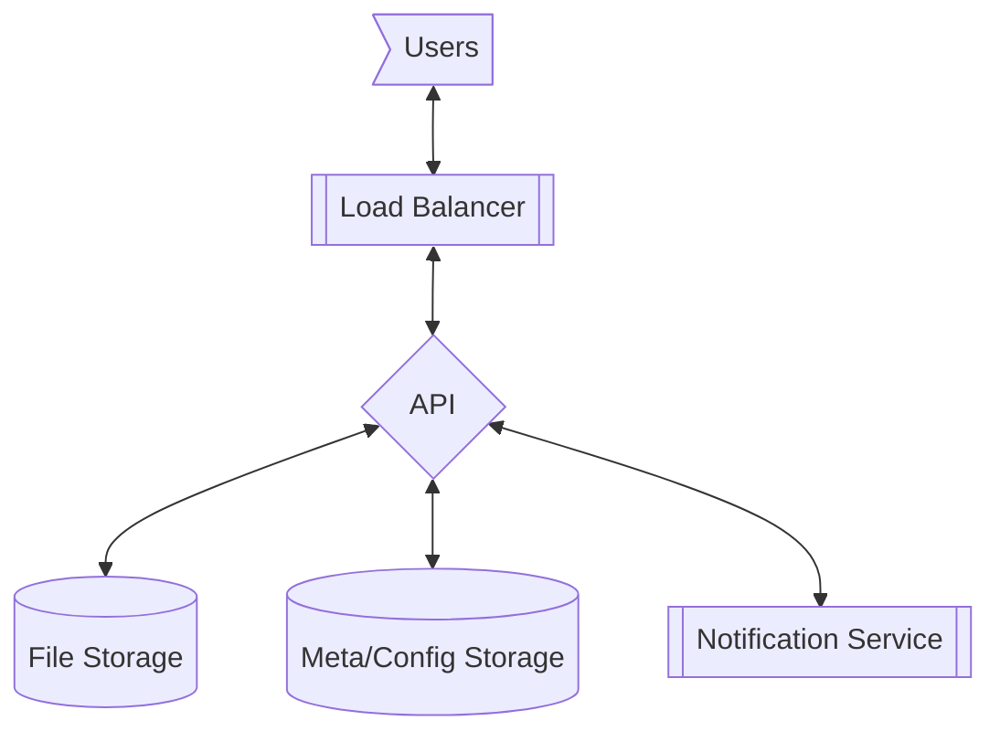
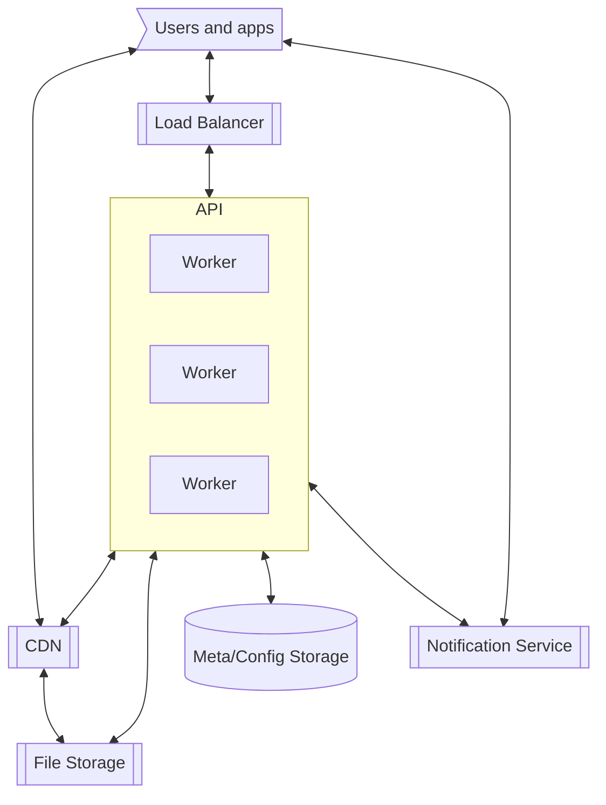

# Topic

Google drive is a storage engine which allows for users to have their own storage space. Unlike shared resources we expect most resources in the drive to be shared between a set of people rather than be public.

That said, in some cases, we may allow a document to become public and allow this document to be downloadable for multiple people.

Another thing to consider is that the cloud storage has permissions of view/edit/etc.. on a document and some total size allocated to a user or organization, therefore what is the maximal capacity allowed per user.

We also need to take into account the indexing or "drive tree" that a user sees. This folder tree would allow the user to navigate through the files. A search, user specific one must be implemented to allow also searching through the user documents. We may also include autocomplete and other features, which would need to be taken into account.

Finally, though not used by all, local sync must be also taken into account. We do want sometimes to work with a local machine and sync these files to a remote machine. Backing up our work.

## Questions about scope and requirements

1. Who is using this service? Private users and enterprise users.
1. Is the service used to sync local drives? Yes.
1. Is the service used with shared documents? Yes.
1. Any other way the users interact with the service? Receive notifications (Edit, delete, shared.. etc). See file revisions. File and folder operations.
1. How many users? 10M DAU
1. How much traffic per user? Each user downloads 1 document per day, on average. Uploads 1 document per day.
1. How much data a user holds? 100GB max, avg. 10Gb
1. Whats the median document size? ~1Mb.
1. Whats the max document size? 10Gb.
1. Data format? Any. Assume blob of bits.
1. How long do we have to keep the data? Forever.
1. Dose it need to be encrypted.
1. Whats the download speeds we expect? As fast as possible.
1. Whats the api operations we expect?
   - upload
   - download
   - share
   - list (ls)
   - move
   - mkdir
   - delete
1. CAP - Consistency - eventual. - Availability - all times - Partitioning - stable against partitioning
   going for `AP`
1. Any limitations we may have? Hardware, Software, People?

# Example

Alice loads a word document "specs" to her folder "Work", she then shares the document with Bob
Bob, can list for documents, sees the document under shared/form and can download it, or move it to another location.

# High level design and considerations

The goal of this system is to provide the user with on cloud storage where, A user can operate on files,

1. Store and Download with revisions
1. Share
1. Sync to local
1. Perform file operations (delete, move, list)
1. Receive notifications

e.g. we have,

## Data

Lets first estimate the size we need, we have 10M DAU, each user has ~10GB, so we have 1e7\*1e10 = 1e17 -> 100PT of data. Lots and lots of data. Is this data unique? Well it should be, plus we need to keep revisions of the data. Note that this dose not include replication, in which case the size of the data would be much larger.

### Traffic

We know that per day, we have 1 user upload and download 1 document, each document in avg, 1mb 1e6*1e6*2 -> 2TB of data traffic per day. Or 2e12/9e4 ~=0.22e8 ~=3e8 bytes per second. ~300mb per second. Not that bad.

### Metadata size

Even though our data is very large, we would need to keep much smaller dataset to describe a document, assuming, on avg, that a user may have 10GB of data, an 1mb per document, then a user will have 10k documents. e.g. The system, 10e6*10e3=1e7*1e4=1e11 documents, each documents would contain,

1. Document ID 20 Bytes (UUID)
1. Owner ID 20 Bytes (UUID)
1. Version File ids [100? max], say 20 bytes each. 2Kb

(We can also store teh version file ids elsewhere, but its convenient for now)

So we would have ~2e3\*1e11 = 2e13B = 2TB of data. Not that bad. A simple consistent database, like say cassandra can handle that.

## Storage

Since we have that much data, we will for now assume that the storage service is persistent, and external. This storage persistance is key to design and can be uploaded later. We can use a CDN to deliver our data in case a document becomes public, but otherwise will not be needed in the case it is not public. We can also put a number of shares for the document to become public.

That said, we do want the user to retrieve the latest version of the document. At all times, even if using a CDN. This would mean that we would need some unique key for each document version. Thus not needing to update the CDN in the case of a version change.

## Sync

Since may be the larger load on the system, and therefore we would need to update the sync'd document by just the bytes changed. If that is possible, we can reduce traffic by a lot, and traffic notifications. For now we will push this "partial update" feature to our data store, and note the data store can receive a request like,

1. Update document id, with bytes `bytes` from location `x`.
1. This would create a new version.

When downloading a sync, we would need to update the document with the partial update. And therefore would need either,

1. The accumulated changes for the document.
1. Or if that is larger, the document itself.

### Client

The sync application must be built to access and interact with the sync api, allowing local storage. The local state will either update the remote server or will be updated by the local machine.

### Conflicts in sync

We can either implement a "time clock" or a "logical clock" for the purpose of defining which actor is first or last.

If we use logical clocks, we can use the document version to deal with conflicts, where the first document version to be updated to a new one, always wins.

If we use timestamp, since we are dealing with human interactions, which are much slower than the clock, we can record the time difference between the server and the app, sync these, and make sure the service records the closest UTC timestamp. If two timestamps are the same, take the first one, ignore any timestamps less (or equal?) to that.

## Document storage

Or document storage for now is external; we may demand the document storage to have all the versioning internally, thus providing a service that will return the versions of a document, the "change delta" for that document in case of sync, and some other descriptors of that document.

### Replication

In the case as our external data storage dose not provide replication (for bucket lets say), we will have to generate the replication ourselves, this can be provided by the api.

But in most cases, in modern storage, replication is available, and therefore should be used. For example s3 provides both revisions and replication of the service data.

## Folder structure

For each user we would need to keep a folder mapping, for the available folders. This would be better then to scan the documents for speed. We then need to also save a map, folder->files. To allow loading of specific files for the document. For this we would need to indexing keys,

1. User
1. Path -> file id/folder meta

## Notification service

We consider the notification service, that can either, send messages through the sync api or send messages via external notifications (email, push, beeper). This would be an external service, that may expose actions though the sync api, but would otherwise be unrelated.

We can use an external notification service, preferably in org one, that has multiple platforms available. Thus, we can notify the user in many ways on the changes, and trigger the local app poll in case of a change. This would depend on how fast the notification api is, and if that api is fast enough. If its not, a custom notification api would have to be implemented.

Note that we do not want to use the notification api to send changes to the client, since we are not sure what state the client is in (And each file the client holds). We would much rather keep the client state local, and use notifications as a trigger to pull changes. That would require much less of the client.

## Load

From the above we have load at,

1. The File storage service
1. The API and metadata database.

Notably, the api service bottleneck would be on the data from the database. Since we are using a lot of unique keys (files are unique per user), the question is can we wait for eventual consistency?

Assume a user send and update from machine a. Tries to download from machine b. If b still downloads the old version - this is ok, user may assume it was not updated yet. If this is a versioned document, the metadata of the document will show prev version. If its a new document - it will just throw an error, notifying the user that it needs to wait. Though a bit confusing at times, it is expected by the user, and thus we can accept eventual consistency also on the metadata database.

We therefore can employ a large number of database servers (Cache wont help, lots and lots of keys), but a large replication would both serve as increase in performance and redundancy against failures.

## Hotspots

In the case where we are storing user specific or shared document, we do not expect the data to be shared by many users. At most, if the document is not public, serving it directly from the file storage would suffice. If the document is public, we may expect the document to be read by many people, and therefore would prefer that the document is shared by a CDN.

We therefore can handle the "public" document in two ways. If the document is read/updated by a user who is not part of the shared group, or is not editing the document, we share he document via the CDN and suffer the latency. Otherwise we share the document via the file storage, or through the api directly.

## Communication and Statefulness

As we saw above the only service that would need a "stateful" communication would be the notification service. This service can provide the poll triggers for the sync, in more than one method and across platforms, thus allowing us to re-sync the data.

# Design

# Fault tolerance

For the CDN and the Notification service, we consider these to be external systems, and therefore fault tolerant by themselves. The would have to match the 9's our system provides otherwise our system would degrade.

As for the config database, it must not lose the configuration of the files otherwise the user would lose data. If we use cassandra, which ensures against write failures (Server crash, Node down, comm down), with eventual consistency we would have to set a very high replication since we expect the service to write to many distinct records and to have less hotspots.

# Availability, Scalability and Performance

For the apis and load balancer, these have no state and therefore can grow according to need. Our cassandra database, would have extra nodes to allow many users to read write different keys (cassandra is a DHT ring database, so each key should find a set of managing servers), and thus spread the load on the system. The database should also be deployed across many zones to allow for High availability.

Our system would preform well on both public and private documents, allowing for each type of document to be served though a different path,

1. Private -> directly via the file storage.
1. Public (or vastly shared) -> via the CDN.

The external Notification Service and CDN, would have to match the capabilities of the current system. In meta the CDN would be Owl?

# Monitoring

1. Data size
1. Notification service
1. API load
1. Cassandra load

# Further improvements

1. Resumable uploads
