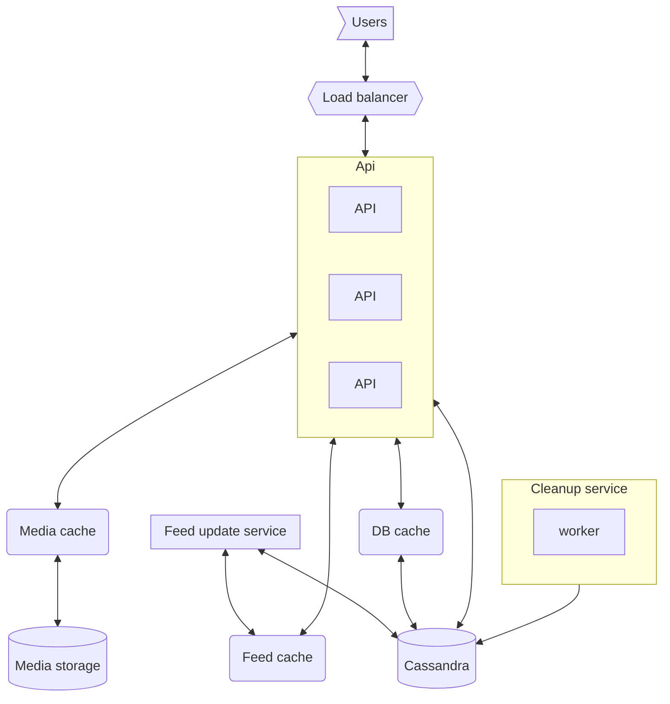

# Topic

News feed system (facebook, twitter, instagram) is a system of stories that appear personalized to your feed, and is rolling, i.e. always continuing.

It should have,

1. Stories adjusted for the user
1. A rolling stories feed, which holds stories that the user can pull from.
1. Fast response.
1. Selection algorithms should be adjustable and flexible - allow external processes to weigh in.

Story is,

1. Media (photo, video, collection of photons, text, etc..)
1. Time when the story was posted.
1. Who posted the story.
1. Other metadata (age limitation?)

## Questions about scope and requirements

1. What is the use case? How do users use this data? - user sends posts and can see their friend posts, according to some algorithm.
1. Users are only people? No, can be services that send posts (ads?)
1. How many users? Expected 10M, but can be more.
1. What is the traffic? What we expect? 10M posts per day - or 10e6/24/60/60 ~ 100 per second.
1. What is a post - see above.
1. What is a size of a post ? say 10kb - 10mb.
1. Do we need to store the data? For how long? ~30 days.
1. If it was an api, users can
   - send post
   - get top posts - what is the order? some algorithm, including the chronological order.
1. How many followers can a user have? Inf - unbounded (like twitter or instagram)
1. Cap

   - Availability - as high as possible, we do not want the service to go down.
   - Consistency - can lag behind, eventual.
   - Partition - we would want this to have partition tolerance.

     e.g. aim for `AP`

1. Do I have any limitations? Hardware? Software? People?

## Example

A human "alice" sends a post, alice has many friends including bob. Bob likes to see stuff from alice and therefore the post would appear on her feed.

"Alice" also likes seeing posts about skincare, a service "mycare" posts about skincare, alice should see it, if she friended that service.

# High level design and discussion

## Purpose

1. Allow to receive posts, and store them
1. Allow to view posts in feed.
1. Feed is personalized and matches my tastes - I want to consume content I like first.
1. Allow adding rules to my feed.

## Definitions

maybe later

## Some calculations

### Data

Since we are getting at max 10Mb per story, and we have ~100 stories per second, we should expect about 10gb per second max data. This is a lot. We therefore need to take this into account. We can reduce the requirement here and process less data, but separating the media upload from the normal post mechanics, this reducing the data intake of the posts to ~100kb per (including metadata about the media added) - this should allow us to get a more reasonable 10mb/second data intake.

Since users see data periodically, and should pull stories ~1 time per minute at max - assume we return some 10 stories. But we may have many more users than the number of stories posted. So in this case we would expect the download traffic to be much higher. That is we would expect mostly downloads.

For the data size, without media, we have ~10MB/s -> 10e6*30*24*60*60 ~ 1TB of data for metadata storage. We will store the media artifacts elsewhere.

We should consider adding cache to the slow (eventually) updating data - i.e. story media and metadata. This would mean that we can have the story data loaded faster, and from a more local location, reducing load on the database.

For story lists, and what to see in the feed, it would be better to load data from the database since we would need a more current status on that. That said, there may be a place for cache here as well.

### Users and posts

Since users have a network of friends we can expect the number of friends ~1000, but there may be some many users that haven many many friends. That would mean that we should make sure the action on the post side is atomic as possible, and somehow order the friends a user takes and check these for new stories first.

We can also consider that if "alice" posts a story, there may be multiple categories this story can go into, and therefore allow to further categories the lookup table on "bob", I like "alice" stories about x, and like "service" stories about "y". We can also add some algorithm to take into account likes.

## Load

So we expect the load of the system to be on the download side, that said, when a burst of posts appear we would like to handle that as well. This would mean that the API that loads stories from the database would require more bandwidth, and more workers, while the post ingest can be slower.

This also makes sense since users or services would produce not many posts and ones consumed.

## Category considerations

We said above that we need to add a story as a category, inside a user category list. This would mean that we need to keep a record of stories, and a record of categories

That is, per user, we should keep a list of categories with,

1. last updated per category.

And each story should have a list of categories for it, which can than be consumed by other users.

## User "feed from who" consideration

Lets think from the user feed side, the user should be able to pull data for a specific set of users, rather then for the entirety of users it has. Since it has a list of user,category ordered by likes, we can pull the first n users ordered that have changed, order by likes and then use these to load the data for the feed. This may be slow, but using cache if ~1 second we can avoid overloading the database.

## Data structure

Fill in a bit.

Users:

1. Friends - and like score
1. Categories - and like score.
1. Categories - latest changed.
1. Last feed pull ts.

Story:

1. User
1. Metadata
1. Date
1. Links to media
1. Likes

# So far

1. We understand the load is on the download
1. We understand that posts intake can be slower.
1. We understand that data 10mb/s and total 10Tb of storage would do.
1. Our api should implement,
   - put (story)
   - put (media)
   - get (feed)
   - like (story)
1. To make media and story download fast we should add cache to them.

# Design

Services,

1. API Cluster
1. Story, User info, Config database(s)
1. Cache - fast story get (So we wont reload stories)
1. Media storage
1. Media cache - fast media get (maybe location enabled)
1. Cleanup service (delete old)
1. pub/sub - external services trigger to run adjustment of the likes and dislikes.
1. feed update service - periodically updates active users feed, to decrease feed load time.

## Graph

## API

Commands on the api

1. Put (story)
1. Like (story id)
1. Get -> feed stories

### Put

The api exposes a story put, which allows the user to post stories. When a user uploads a story,

1. upload all media via put media
1. create the story metadata
1. send the metadata to the api.

On the api side,

1. Get the story
1. Get the rules for positing stories from cache. Reject if dose not match.
1. Validate the media (via cache) or return error.
1. Get the rules for categories of the media.
1. Parse the story metadata (and if needed, the media metadata)
1. Add the story to the story lists, and mark the user.
1. Mark the user categories as changed. This user has something new from this time in its categories. (max(current, new date))
1. Send a message to the pub/sub api.

Now we have a new story in the pipeline, and the user categories have been update to the latest date. Allows us to pull newer stories.

### Like

This command should update the user preference about a story. Since the user likes this story, they would like the other user more.

1. Get a like + story id
1. Pull the story from cache
1. Get the categories, and user (poster) of the story
1. If this user is a friend ignore (we can do other stuff here)
   1. Add +1 to this friend in data.
   1. Add +1 for each category of the story.
1. Add +1 to to likes in the story

### Get feed

We need to return the story feed, which is specialized per user. Though many algorithms may exist, we will keep the pull algorithm simple, and allow other services to adjust the weights of the stories, with respect to users.

We can pull stories with requests to the cache service, making this feed faster.

1. A get current feed request.
1. Check the feed cache, if feed exsits return it.
1. Do a call to db to get the user (not cache).
1. Get the list of N users that I have, and priorities these users, according to like
1. Do a request for cache, for all stories that match,
   - any user id within my users.
   - sorted by maximal score, where `score=user[like]*category[like]*story[likes]`
   - Given the maximal weights
   - filter the stories buy rules.
   - repeat until we get an N list of stories. If users dont have any new stories then use that.
1. return the stories
1. update the feed cache.

## Cleaner

Since we do not need stories that are older than one month, we can delete them and reduce the data load on Cassandra. We may, in this case, want to move these stories to a less active storage database where we can "archive" the data. In this case the cleaner would have more steps.

1. Loop over,
1. Delete all stories older then x.

Note that the cleaner services can also be integrated into another system, where there are scheduled jobs that need running. This way we can externalize the cleaning system and add offload the monitoring for it.

## Discussion on load

Note that we are offloading most of the heavy tasks on the API workers, and externalizing the metrics and adjustments via the pub/sub api - where other monitoring services, and scheduled jobs can read and just the weights for users and categories. This would mean that no statistics load is going on the API workers.

One can think of better algorithms for the api services, which run externally, and provide periodically update a list of next stories, this service would allow to offload some of the load on to other workers and down time. This can be good for active users, but may be very wasteful for non active users. For this we can do some kind of queue of users recently accessed, thus reducing the load. This would mean that the news feed would be a little not updated. Not that bad.

# Fault tolerance

When considering fault tolerance, we know that,

1. If we cant post a story - just return error. This is ok. No need to catch all stories.
1. If a news feed is a little behind - large load - that is ok as well.
1. We need to make sure the service is active at all times, but it dose not have to be fast available and some slowness is acceptable.

So this just leaves the down time. We can address this by adding nodes of the database(s) in multiple nodes in multiple zones. Once we achive HA for the database, we can be secure in that.

For the workers, we can increase or decrease the number of workers (even dynamically) to make sure that the service is not down.

# Performance, Scalability, Availability

Since all workers, apis and non database entities have and require no state, we can increase and decrease them as we like. Most of the load is there, and therefore we can just increase the number of workers to adjust to load.

For the case of the database, the cache system would provide (older) but fast data to make acceptable discussions about it. Even if the latency is a few seconds, it is acceptable for users.

For performance, the cache system should allow for fast resolution of queries to the database and would also allow for fast download of artifacts (media) from more local servers. This should greatly increase performance and deal with hotspots. (OWL?, hotspots may happen if we have many users looking into the same post)

# Monitoring

1. API load - add more workers
1. Number of posts
1. Database load - add more database servers.
1. Cache load - add more cache servers
1. Network load - add more local servers to reduce transfers.
1. Hotspots - maybe we can adjust the media according to posts that have hotspots? (Owl)
1. Queries for users - active users vs inactive users. To see if anyone is using the system.

# Further improvements

1. One can think about more complicated system to update the weights of selection.
1. We can add posts from "trend leaders" in the categories the person likes.
1. We can add external update of categories weights according to what the user watches (downloads th media for), or other metrics collected.
1. We can think to implement a background process to update the "current feed" for active users, this would allow these users to fetch the feed faster, and would not waste resources. If the user calls the news-feed before it was calculated it is calculated in place, allowing for less active users.
