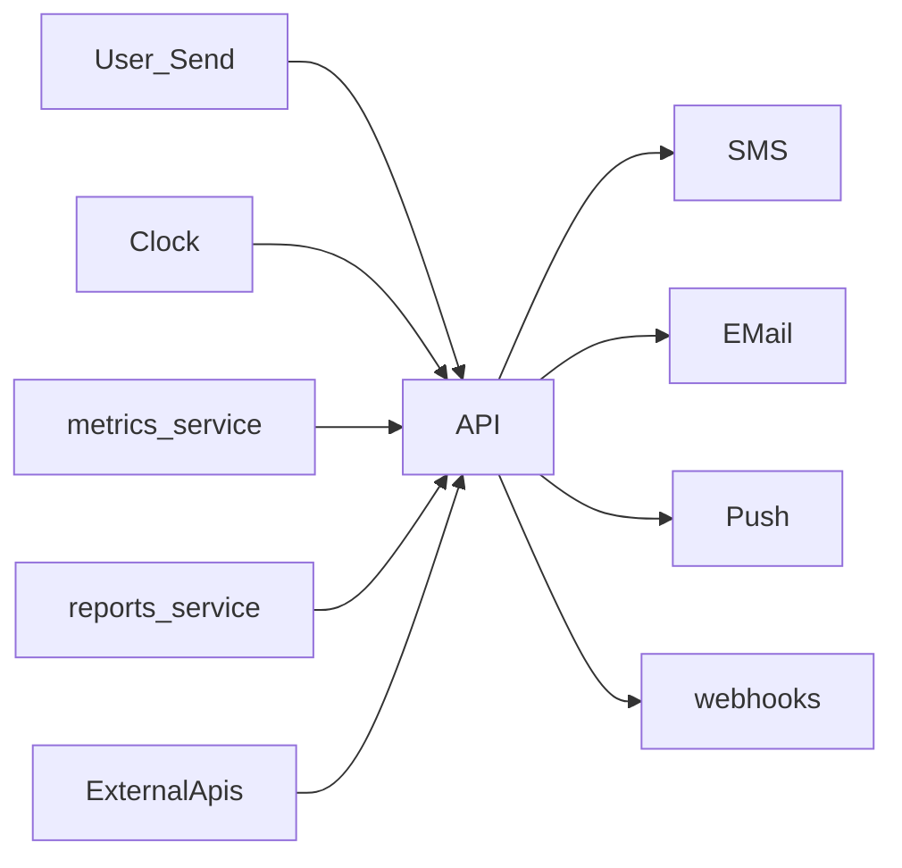
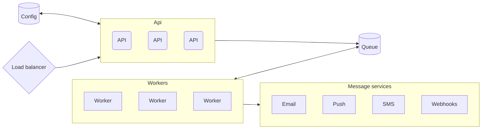

# Topic

A notification system (PageDuty, alert messages, Prometheus), is a system that when certain metric is reached will send a notification message to humans or to another system. The key word here is the metric and how we accumulate data to reach that metric, this can be,

1. Collect stats and trigger if the stat has reached.
1. Parse text and look for triggers.

When a trigger is reached we would need to check if we should trigger the alert (Token bucket?).

This can be,

1. News
1. Alerts
1. Errors
1. Status
1. Metrics every x
   etc.

Methods can be SMS, Email, Push (device), Beeper :) etc.

## Questions about scope and requirements

1. Who are the users using this? (Users in system - humans)
1. What kind of notifications we support? (Email, SMS, Push to app)
1. What kind of data should we expect? JSON + binary files (images, videos etc)
1. What are the triggers? User actions, timed events.
1. What is the latency we are required to? Delay is acceptable, but as short as possible.
1. Traffic volume? 20 million actions per day, 10M push, 5M emails, 1M SMS.
1. Data size? Depends on the notification, from 1kb to 100's of MB
1. Do we need to keep a record? Text for 10 years. Files for 1.
1. Do we need to keep track of notifications? are they in order? Yes (timestamps)
1. What operations are available? (PUT, GET current, etc..)
1. Dose the application need to accept the data and store it? Is the data pushed to the application? The data is pushed from sources like user or service.

## Questions about limitations

1. Are we limited in hardware?
1. Are we limited in storage?

## Example process

A news site creates a new article every day.
User registers to get news updates, from this channel.
User is notified when a new story is posted.

# Considerations (High Level)

The basic requirement for us, is



Note that the services like metrics, reports or clock can be fed by the webhooks registration -> they will generate a request that will then be ignored if resent to themselves.

This would mean the api would need to send a lot of messages as a response to an incoming request. e.g. every input request may generate lots of output messages.

This would mean our **load is on the messages**.

## Define some stuff

**channel** - a topic/bucket to which messages can be sent. This is the "to" of the message. (can be a specific user, as in the user bucket)

**endpoint** - A target for which to send the message to (push - android user, email, or phone number)

**consumer** - a consumer of the message, each consumer may have multiple endpoints.

## The report format

Our report may contain,

```json
{
  "channel": [],
  "text": [],
  "files": [],
  "timestamp": 0,
  "metadata": {}
}
```

## Estimations and data size and storage

We expect 20 million actions per day but not sure about the data input, we therefore expect ~ 20e6/24/60/60 ~= 300 actions per second.

Our data may contain files and therefore can be very big. But notably, we do not need to store the files in the same location of the message data and can delegate the file storage to somewhere else. In this case, we should store the text, links to the files and the metadata json. If we say that a proper message is ~10zk of data, we should expect ~20e6\*10e3 = 20GB of data per day or 6TB of data per year. This is large but not impossible. For file storage a different service would be needed.

**For now** We are ignoring the file storage.

In our case, once a notification is sent, it can be deleted since we are not required to keep store the messages for posterity.

## Message delivery

We understand that a single message can be sent to lots of endpoints. Firstly, for each message we can send to multiple channels, each channel, may have multiple users, and each user may have multiple endpoints.

i.e. The load of the system is heavy when sending messages. A single request can cascade into millions of sends. Therefore we should have some parallel way of sending messages which can grow with the system, that is irrespective of channels. We want our workers to **grow with the number of messages** that are in the system and not the number of channels we have or number of users.

## Optimization on message sending

Since we are expecting lots of messages to be sent, if possible we may bundle messages together to be sent to a specific user. e.g. if there are a 1000 push messages that need to be sent, then we can send them with one query to the api email api.

## So far we know

1. System load is on the message sending side.
1. We want to make sure we dont lose any messages.
1. We want out message sending capability to grow with the number of notifications being sent out and not the number of requests the come in.
1. Our traffic is large, but since we are not saving historical messages, we do not require a large database but rather a fast once, which is persistent.

## Conclusion so far

1. We may want to separate the sending service from the service that handles the collection of incoming requests, so we can just send messages out.
1. We should avoid sending messages multiple times - our queue would need to keep track of the messages being sent.

# Design

Parts,

1. Queue Database - redis - fast and DHT (ring). Keeps track of,
   - message queue
1. Config Database (can also be in redis, but we can use another slower database),
   - Channel + channel consumers.
   - Consumers + endpoints for consumers.
   - Rules on sending
   - Other config data.
1. Sending cluster - workers which consume messages from the queue, and send them to appropriate api.
1. API cluster - with load balancer, api implements,
   - register
   - listen
   - send



## Queue database

Redis DHT, will hold queue of messages to be sent.

## API

On notification request will (send),

1. Check if channels of the message exist, if not return error.
1. Get the consumers for these channels.
1. Check which consumers are allowed this message according to rules. If cannot send to users we can send a warning report to the message generation. Can be a flag.
1. For each consumer, get the consumer endpoints. For each endpoint add a message to the queue.

On listen request, (channel, consumer)

1. Add a channel if dose not exist to the config database.
1. If a consumer is not defined, stop.
1. Check if the consumer exists. If not return error.
1. Add the consumer to the cannel

On register request (consumer, method)

1. Add a consumer if not exist
1. Add a method to the consumer if this method dose not exist.

### Missed messages

On error; the api will return server error to client, notifying that the message was not delivered. We can add a middleware here that will catch the request and make sure all requests are delivered, but it dose not need to be internal to the notification service.

## Workers

The workers will consume notification messages and send them to the user. Note that we are currently ignoring bundling the messages, but just working on sending them.

The worker loop,

1. get new notification from queue (or multiple notifications say 100)
1. check the consumer exists, and it has methods, if not ack. and continue to next.
1. for each method in the consumer, send the message to it.
1. if error then revert the ack (ack error, and the message should return to queue)
1. else ack. Message delivered.

# Fault tolerance

The above system should be fault tolerant against failures, the redis database would restore in case of a crash. The api would send a message failed in the case where the server crashes.

Messages that have been received will be sent, eventually, to the clients.

The message workers are stateless and would send message ack only when the message have been sent. This would mean that even in the case where the worker crashes the message will be sent.

# Performance, availability and scalability

Our messages may be delayed a bit before sent, this would depend on the number of workers in the system pulling messages to be sent. This would increase the delivery time of the notification.

That said the system would be highly available, we can put workers in multiple zones, add as many workers as we want - even dynamically, and allow messages to be pulled as fast as possible. Putting workers in multiple zones and API services in multiple zones would allow us to be available. The database can be put in multiple zones as well to produce a fast responding db.

We can also scale horizontally every part of the system. Though we will be dependent one queue. That said, workers can pull multiple messages from the queue, and writes can be done with eventual consistency - since we may not care about the order of the notifications.

# Monitoring

We would like to monitor,

1. Worker load
1. API load
1. Database load and size
1. Message latency - how much time a message has waited.
1. Message registered count vs message delivered counts.

# Further optimization

1. Our send response is slow(er), this is since we need the api to pull all the workers. In the case we want to be able to recive lots of message per second we can add another queue of the requests, and then process these later. A middleware option is also available.
1. We can add support for "all" channel.
1. We can consider adding messages to a different retry queue, with some delay time. This would allow our workers to retry messages later on, in case the message sending service was not available.
1. We can also consider alternative apis, or select first successful. That is the notificaion would be send to the first service (SMS) and if cannot to the second one. Etc.
1. Since we do not expect a single consumer to have a lot of endpoints, we can instead of writing endpoint and message, we can record message and consumer. That way we can add more complicated rules on message sending.
1. We can add a cache layer for the configuration and the users info, this way we can store cache in memory and wont need to go to the database for every message. This would mean that the service would require more time to update new listen commands but thats ok. The cache can be implemented in the API server, or can be implemented as a different hash ring without storage. This would mean that it would be very fast and would include multiple servers.
1. We can add rate limiting, for a specific consumer. This can be done when the worker reads the messages, in the form of a token bucket.
