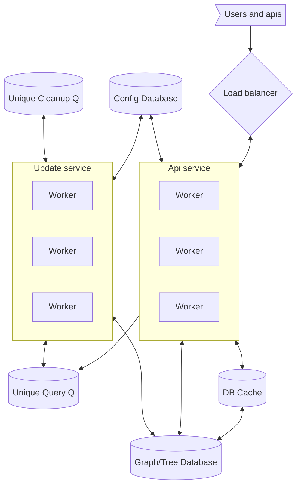

# Topic

Search autocomplete is a common feature in search engines where data is pulled to complete the text of the search, for things that are commonly used for search. The autocomplete must handle lots of data since there are many search options.

"Design top k search queries, given prompt"

## Questions about scope and requirements

1. Who is using this? users
1. Do they expect personalized results or general (all users)?
1. How many active users do we expect? 10M DAU
1. What is the result list size? 10
1. Data format? json
1. How fast do we expect the result to return? human non noticeable.
1. What would be the operation? Request results for prompt
1. CAP
   - Consistency - eventual, we would like all users to eventually see the same results.
   - Availability - All the time.
   - Partitioning - Service should be resilient against partitioning.
     e.g. `AP`
1. Any limitations? Hardware? Software? People?

# Example

A user enters a search word in a web-browser, they get a list of 10 possible completions.

# High level considerations

Our service must find a way to return results, for the keyword very fast. That means, each combination of keywords should, together, become the key for the return

If the user searches,
"who is the best baseball player"

Words would be `who,is,the,best,baseball,player`. And this sentence should be stored under,

```
[who] -> sentance
[who, is] -> sentence
[who, is, the] ->sentence
...
```

Thus allowing each key to have its own list of results, and allow us to search for these results within this key. This is a graph, which has a key set?

## Consider a graph?

Our results could be stored in a graph, and we can add weights for each item in the graph. But, in this case, each graph node would have many connections to other nodes, thus having a slow response.

We would need a way to update the graph result, including the ordering of the "10 to return" within the node. If that can be done, when we query the graph node (which would happen a lot more), we would be able to get the result for this word very fast.

## Delayed updated

In the above requirement we would not want to update the graph nodes in real time - since we do not want to delay the search. That would mean that we can accumulate changes to the graph nodes and process these later on.

## Tokenization

We should note that we can tokenize the search query in many ways, and that, in its turn would determine the keys in the graph. That said we will take currently the tokenizer to be space split. Other tokenizers can be implemented later on.

## How to calculate what is the best responses.

For each node, in our graph we would need to keep a list of best queries to return. And return these best queries, given a known query.

If we do this, we move our update load onto the updates service which calculates the resulting word. This can be problematic, since we can have multiple similar results, say

"who is" -> who, is -> set
"who are" -> who, are -> set

Since for token we get a set of possibilities, the total set of tokens in the graph would increase with the number of set options -> which can be huge. That said, on the update side, we would in general be required to to have N node updates as a function of the number of tokens.

## Update nodes algorithm

Say we get a new query and we need to add it, we would need to recalculate the possible responses along each of the token sets which describe the node.

i.e. We would need to update the data of the node to have a list of best responses. For that we would need to (per node)

1. enumerate all possible responses (best to start from the longest set)
1. wight them
1. pick the best 10.

Say we get the query (tokenized), ["a","b","c"], our sets are,

```
a
ab
abc
```

Start with abc, check its node and make a list of the the set itself + all best 10 sets for all child sets of it, order these according to a wight function (order + child global weight), and pick the best 10. Update the node.

do the same or ab, and a. In that order. We now updated the best response list for each of the nodes in the set.

**Note** the global weight can be calculated as the negative score noted above.

Note that this update is an O(K) where k is the maximal token size (say 20). And should be fast.

## Goal

1. A user types a search keyword(s)
1. A user gets a set of options to complete back.

## Calculations

### Traffic

The user only dose one search on a combination of search words, that would mean that we scale the input linearly with the number of searches. Since this can be very large. We would prefer to have some queue for searches, without duplicates (e.g. queue (query, times)) where times is the number of times it appeared so far while it was waiting sto be processed -> lock a queue entry while processing it. But thats ok since we are looking for `AP`.

Since the api's autocomplete return would depend on the number of users are currently typing, we would except the number of api calls to scale with it. Since we expect users to stop typing say 10 times and get 10 results for each search, we would expect 10*10M requests daily, eqch query ~1kb or so, so 100e6*1e3/24/60/60 ~-= 1M/second. Not so bad. This would also increase with the users.

### Data storage

As time goes by we would expect users to fill out the phase-space (all options) of the possible queries, as this space fills out, we would store less and less data. On the other hand this space is very large.

If we limit this space to max 10 tokens, and make sure all these tokens are dictionary words, we can have easily (100k)^10 tokens in the graph (including common words only). Since we are building sentences, the number would be much larger. We therefore need to reduce the number of nodes in the graph. The number of combinations would be very large.

One consideration would be to keep most common token sets - and delete unused token sets? But how would we know which token sets are obsolete?

Time - last accessed
Count - number of times accessed

Token set weight -> `(now-time)/count` -> negative score. Would allow us to remove unused token sets and keep the node number much smaller.

We can actually, set a expectation number for the number of nodes in the graph, and thus allow us to remove old data given its score. (Store max score, get number of nodes, and calculate dead score).

If we consider each node can hold 1K of data, and aiming to keep our database smaller, say 10T, then we would have about 10M nodes. Or 10 million total autocomplete options.

We can think of other implementations that include the relative score of a node to be removed, but for now we will just call this the node removal algorithm given a global score. This could be applied both we update the grpah nodes and via a job service.

## Load

As noted above, the main load of the system would be to insert new searches into the graph, since we would need to do at least N operations per request and update the node set to match (which for itself would have a current active set of results). Our workers can be slow though, since we are collecting the data from the multiple search queries at once, thus combining operations

For the API side, we know that we are querying a node for each request - the token set node -> and therefore would require a lot of work from the graph database. We can hide this by using cache, which would would be behind the current latest results but ok for `AP`, and eventual consistency.

## Hotspots

Since request hotspots are via the graph database, a cache system could in general reduce the load.

For the node updating, accumulating similar queries should reduce the load.

## Coms

Our approach should use http requests. Rest is good.

# So far

1. The main load is on the node update.
1. We need a way to score the relevance of a node.
1. The scoring should be both relative to time and to number of similar requests.
1. We do not wanna keep all nodes -> very large.
1. The data size would be dependent on how many options we would like to present the user.
1. We do not!! want to do any calculations when the user asks for complete options.

# Design

We consider the service we need,

1. A graph like database, where nodes can be accessed by key.
1. An API where
   - get completions (query)
   - add query - full
1. An update service for nodes.



## Api

Api will receive requests from

1. users - for auto complete
1. search service - a query was submitted.

And will have,

1. get (query) - return the completion
1. put (query) - add the query

### get

1. Tokenize
1. Look for the appropriate node (using cache)
1. Return list of completions.

### put

1. Tokenize
1. Add to pending unique queue

Note that the service should not wait for validation, if we wanna ensure that all queries are captured, we can add a middleware here to ensure delivery.

## Update service

Two loops (different workers)

Update loop, Unique query Q.

1. get next query from queue.
1. tokenize
1. get all token nodes in the token sets. (See example sets)
1. Updates the nodes according to the update algorithm
1. Add any nodes that are leaves to the longest token, to the cleanup queue
1. Use the minimal score of node to update the global minima (eventual)

Cleanup loop

1. Get the next cleanup node
1. Get the global negative score.
1. Calculate the node score.
1. If score below global minima expectation, delete node and children.

**Example token set**
"who am i" -> [["who"],["Who", "am"], ["Who","am","I"]]

# Fault tolerance

Our graph database (say redis) would have to be `AP`. We do not really care about the eventual updating of the node list, since we have no point where we require strict consistency in the design. At worst, we can have a case where we update a queue request twice, this would change the statistics but should not affect the result much.

One can consider using a more "strict" approach for the queue, say RabbitMQ, in which we would get only once Delivery. That would be more prone to failures.

# Scalability, Availability and Performance

Considering performance, we can see that most actions in the system do not cascade, that is, for each query our processing time is O(k), and therefore dose not depend on the number of nodes in the system. Even if the db is very large, we can in general provide a fast response for new queries.

Node deletions, and data removal can happen at its leisure, since if the DB expands and than contracts that is ok. As long as, in the off time, data is deleted.

Cache system overcomes hotspots.

The API is O(1)

For scalability all systems are distributed, and therefore also available. Api and workers are stateless and therefore require a connection to the database and the queue, but otherwise will be available.

# Monitoring

1. Size of db
1. Load on API
1. Queue lengths
1. API is available.

# Further optimizations

1. We can consider many tokenization method, ones which take into account spelling mistakes etc. This would reduce the number of nodes.
1. We can consider other methods to delete nodes from the database, allowing for better use of active nodes.
