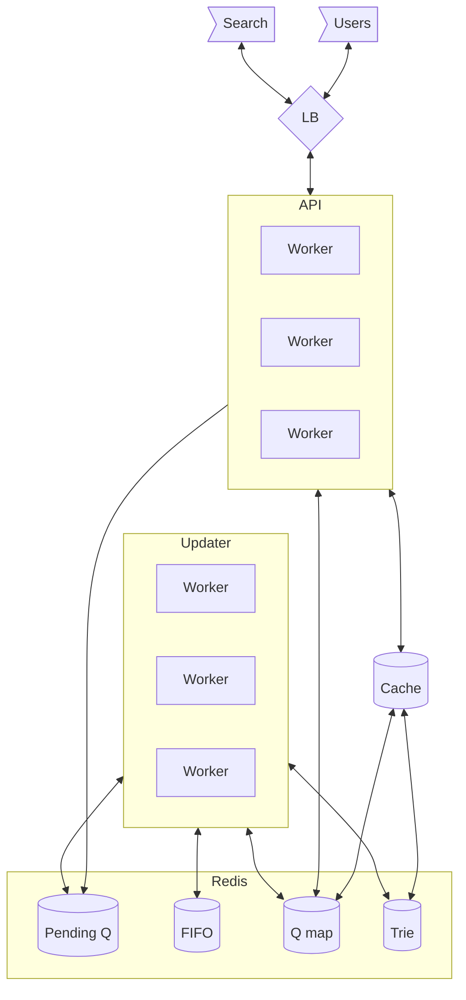

# Topic

Search autocomplete is a common feature in search engines where data is pulled to complete the text of the search, for things that are commonly used for search. The autocomplete must handle lots of data since there are many search options.

"Design top k search queries, given prompt"

## Questions about scope and requirements

1. Who is using this? users
1. Do they expect personalized results or general (all users)?
1. What is the size of prefix we need to take into account? At least 10 chars.
1. How do we determine which query to return? By popularity, the more something is queries the more its returned.
1. How many active users do we expect? 10M DAU
1. How much history do we need, e.g. how many of the past queries should we take into account?
1. What is the result list size? 10
1. Data format? json, lower case, not capitalization.
1. How fast do we expect the result to return? human non noticeable.
1. What would be the operation? Request results for prompt
1. CAP
   - Consistency - eventual, we would like all users to eventually see the same results.
   - Availability - All the time.
   - Partitioning - Service should be resilient against partitioning.
     e.g. `AP`
1. Any limitations? Hardware? Software? People?

# Example

- A user enters a search query in a web-browser, once in a while they stop, the api uses the query to return a list of 10 possible completions.

# High level considerations

If we consider that we serve at least 10M DAU, each user ~10 queries, we expect ~100M queries per day.

## Goals

We aim to have a service that,

1. Consumes search queries by time
1. If asked for auto complete will return 10 options, as fast as possible.

## How to store the queries?

For each partial query we would need some information about this query when the user asks for completion. Say we add +1 to each query once its called, we have a data structure of,
query, count
a 100
bb 10
...

In a relational database we would run

```sql
SELECT * FROM queries WHERE q LIKE 'partial' ORDER BY count DESC LIMIT 10
```

And it would work for small amounts of data. But if we are talking billions of rows, this would be come very slow very fast. We can add cache on this, but it would certainly not be O(1).

Another option is to store the information as a tree, that is each letter of the query is a node of the tree. For each node, we can store the most likely leaf nodes (when composing the tree) -> thus creating a trie, which stores the data. The data in trie would go as a CONST\*Query number, where the const is ~10. Nodes in Trie O(N\*C), where C is length (20) and N is the number of unique strings (100M), this would result in max ~2e9\*20 chars ~=Const\*40GB of data in memory. This is completely doable.

There is a further optimization here that can happen, we can use a radix word tree, that is, if we get the queries, `abcd` and `abce` we don't have to record the whole 5 nodes (each for each unique letter), but rather can have 3,

```
abc->d
abc->e
```

In this format we know that expected data size is smaller than the above and is estimated to be 2\*(Number of queries), but this would be too complicated for this example and we would stick with the trie.

## Updating the tree

We want to store the "autocomplete" of the last 100M queries, and delete old queries from this list. That would mean we would want to take into account only the last 100M queries.

For this we would need to update the trie.

Lets say we saved the queries and number of times these queries have been called. We receive a new query, can we recalculate. We wont know which "query" type was removed unless we know the timestamps of the query arrivals. That may take a lot of space.

We can recalculate the tree every day. At the end of the day, but that would mean the tree is not actively updated. This would also mean that our autocomplete approach would give approximate results, assuming that is good enough. In this case we can keep a log of the queries, and recalculate the trie at the end of the day. This simplifies operations.

We can keep a log, query vs ts. And remove and add queries according to the log. This is feasible if done in chunks, we know that to store 100M queries is at max 20GB. And therefore we can just use this log as FIFO. Remove the head and append to tail. This way when we are over the storage max num (our history), we can address the head and tail of the FIFO.

Can we update the tree if we know the query to remove and the query to add?

First remove. Since we have a count of each node along the way, we can go the same route of nodes, and remove 1 from its count. If a node reaches zero, delete that node and its children.

When added, just follow the same path as before and add a 1, or create new nodes as 1.

## Data

Lets do the data calculations again,

1. For the log we need to store 100M queries @ 20 chars per query, in FIFO format. ~2GB. This can be kept in cache memory, and synchronized to database.
1. For the trie, we would need to store 2G nodes, each node will needs to contain,
   - number of times this was accessed.
   - a list of 10 best auto-completions (or links), with their rankings

A node data would look like,

1. Rank - 4 bytes (int)
1. ID - the partial string (20 chars)
1. 10 best auto completes, where
   - text 20 bytes
   - Rank 4 bytes

(We can probably store the rank as 3 bytes, but this would work as well).

The size of this structure would be ((20+4)\*11 = 240+24 = 264)\*2G nodes, would be ~528GB of data. This is large but doable with caching. There is probably a way to reduce this by a lot, by using a hash to the string holding the ID. This of course would reduce the data in each node, but would require a lookup before returning the list of strings. We will ignore this for now.

## Recalculation of best auto completes for node.

In this case we need to remember that for each of the node we are holding the "best auto completes". If we want to calculate the best auto completes for a node, we

1. Take all possible auto completes (with their) of the child nodes, and the child node id as well.
1. Rank them by order.
1. Select best 10.

## Load

Notable, when we get a partial string, and get the autocomplete for it, we have an O(1). This is because we have the data in the node itself and its a hash table random access.

To update though, we would need to traverse the tree, and for each node update the counts and possible lookups. We would also need to lock that node to make sure no one updates it while we do. This is a heavier operation. So we expect the load to be on the updater.

## Hotspots

Sometimes a search phrase is very common. This would be accesssed a lot. This can be resolved by caching.

## Coms

The service can user HTTP REST, there is no need for client persistance. Data is always a result of a request.

# So far

1. We will use the simple trie data storage (though other better approaches may exist, but this should do for us)
1. Our data size for tree storage is ~0.5 TB. This cannot be kept in memory easily, but with cache we can focus on hotspot retrival.
1. We need to keep a log, in the form of a FIFO, which will tell us which queries to remove while adding new queries.

# Design

Our services,

1. DB - probably redis with persistance, though it may have some issues with queues, and we would have to implement a lock. Will hold,
   - FIFO queue (with size)
   - Pending query queue (to add)
   - The trie - in the form of the KVP with children.
   - Partial query hash map. KVP. Fast access.
1. DB Cache - (can also be in redis) used for returning the hotspot partial queries as fast as possible.
1. API Service with methods,
   - put (query) -> called from the search engine api.
   - get (partial) -> return the auto completes for a partial query.
1. Updater service -> reads the fifo and pending queries, and updates the tree.



## Hashing

We use a short hash for the 20 chars string. The hash would provide an id for the partial string query, and will allow us to reduce storage load on the expense of a second lookup in the cache for the load.

## API

### Get

Called by the user,

1. for the partial query, get the partial query node from cache and return the autocomplete ids, for each one, O(10)
   - lookup a the query map (id, query)

### Put

Called by the search engine

1. Check the rules, can this query be added. (Filters?)
1. Add the query to the pending list in redis. This query will be added to the tree later.

## Updater service

The updater loop is works by adding a single query to the db. We can imagine a single worker to pull 1000 queries from the pending queue, (with queue lock), just to allow us to be more efficient. (The queue is an ack queue).

For query, **pending**

1. Check the log size, if larger then N(100M), then pull any values which are over. Dequeue is done with lock and ack.
1. If the pending query, is in the list we got from the need to remove, remove one from the set. No query will be added.
1. Add the pending queue (keep track of nodes changed)
1. Remove the old queues (keep track of nodes changed)
1. For any node changed, check if reached zero count.
1. Lock and delete this node and its children (parent nodes are reached first)
1. For any node changed and not deleted, recalculate the best 10 auto completes with lock (use the above algorithm)

### Adding/Remove to a query

Transverse the tree, adding nodes when needed (Split the query into chars). If a node exists, add/substract 1 to its rankings.

# So far,

we have create a service to update the current state of the nodes, when new queries come in. Our API workers are stateless, and require a connection to a database and a cache service.

# Fault tolerance

We would want the search queries to be taken into account once, but in the case where they are not, we may get some false information in our rank. Our redis database is not strictly consistent, but with pending queue lock we can improve this by a lot. We can also use redis streams to define a group for pulls. This would allow the update workers to pull from the stream without the need to synchronize (basically redis will ensure delivery once). We would still have to run some process in the background to restore pending queries, and reinsert them into the queue in the case of failure.

We can also imagine a case where the tree faulters, since multiple updaters are writing to a node at the same time. Notable is the case where a node is deleted while another process is trying to write to it. In this case we can implement a node lock, that would need to happen before we write to this node. If the node is deleted, then the node need to be recreated. This is a bit of an overhead but still persistent.

Its important to talk about the redis persistent. Redis implements persistance by writing a log to disk, which will happen after actions are executed in memory. This would mean that we may have some data loss if the redis instance falls. Though, this is acceptable since we will quickly recover and we do care about statistics on queries rather then the queries themselvs. The service will still be operational.

# Availability, Scalability and Performance

We can see that our service, though slow in updating the trie tree, would be eventually consistent. Operations from the api are cached and can be in the order of O(10)->O(1), though require multiple calls to the database.

All api servers are stateless, and therefore can be scaled, to multiple zones and become `AP`

The database, redis, is distributed and can be distributed on multiple zones.

This service can autoscale in its API and Updaters, but database would probably remain in a specific size.

# Monitoring

1. The redis databse
1. The api load
1. The query fifo size and the pending size (do we need more updater)
1. The updater service load.

# Further improvements

...
