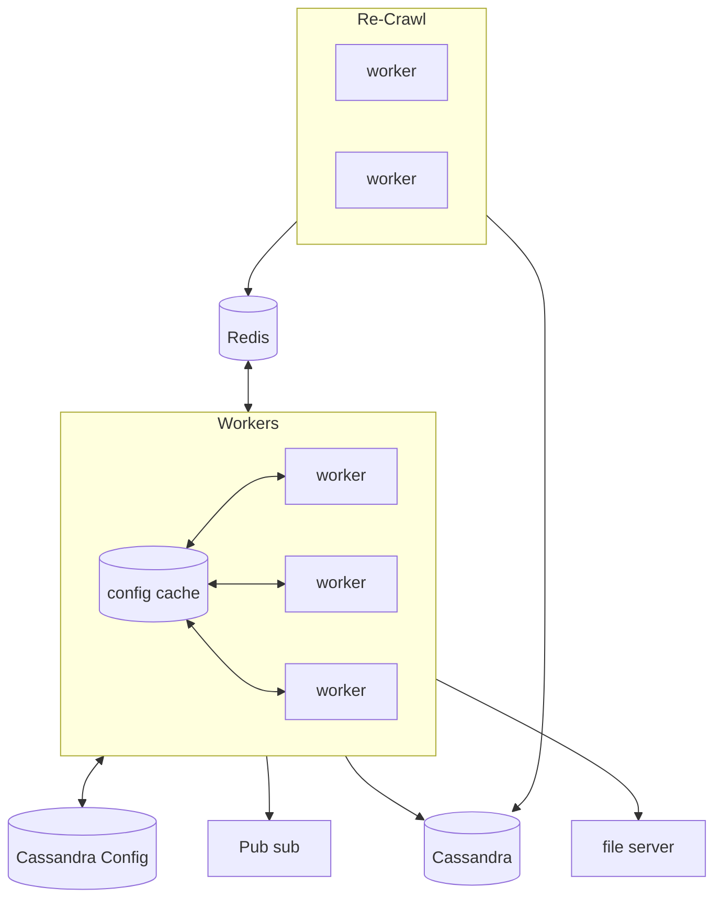

# Topic

A web crawler (or web spider) is a group of machines which, given a set of seed urls, will,

1. Download the content
1. Collect metric on the content.
1. Check if there are any urls in the content to follow
1. Follow the urls and goto 1.

A web crawler should take into account,

1. Security
1. Data size
1. Changes
1. Flexibility
1. Throttling

## Questions: Scope and Requirements

1. What is the purpose of the web crawler? Website indexing.
1. How many websites dose the web-crawler crawl per second? 300 links per second.
1. Do we need to store the data or just index the urls? Store the website statistics, store the link.
1. What is the average website data size? 100kb.
1. Do we store other media which is not html? No.
1. For how long do we need to store the data? 5 years.
1. Do we only download html? Yes.
1. Are we required to run js scripts, or active content? (Rendering) No.
1. Do we need to update the website data? If so, what is the latency?
1. Can the web crawler be continually seeded (dose it need an api)? No.
1. For cap

   - Consistency - yes data should be stored for 5 years. But eventual update.
   - Availability - should be running all the time and keep up to date
   - Partitioning - should be partition tolerant.

   e.g going for `AP`

1. Any limitations?
   - hardware - no
   - software - prefer not to write new things, but possible
   - people - no

## Example of crawler

We give a **seed** of sites, the crawler system uses the seeds to scan the whole web by the procedure above (do as graph)

# High level discussion

## Purpose

1. Scan the whole web
1. Collect statistics
1. Allow other services to load data lazily, and use this data to collect more.
1. Keep up to date.

## Calculations

We should consider traffic and data,

### Traffic

For the incoming traffic (data download) we can assume we have enough bandwidth across our data storage. We expect ~300 d/s @ 100kb ~30mb per second. Or so. This is very much doable for multiple workers. If we calculate per worker we should keep this to ~5-10 MB/second and therefore we should have each worker process about 50 urls per second, which would require us to have ~6 workers. Not a lot.

Note that there is no api requests, but we can estimate the growth of the website pending list. For each url we can expect between 0-10 unique urls, and therefore first we should expect exponential growth of the number of urls in the database, as we scan more of the web, the number of unique scans needed would decrease as fast, and we should reach some steady state. We therefore should expect the database to have heavy load when we start the crawl and the load to slow down when we stabilize.

1. Number of urls - heavy load when starts, then slows down
1. Incoming traffic - need ~30mb/s and about 6 workers (for goals)

### Data

We need to store the information for the websites, metadata of the scan, and probably some queue, where,

1. Metadata - should be fast access, and would be best to allow it
1. Scan data, can be slower.
1. Queue - extremely fast, and ansychronic. If scan becomes very large maybe best to store multiple queues using some hash.

Sizes

1. We expect the data size + metadata size (approx to downloaded since it much larger), 30Mb/s -> 30*60*60*24*365*5 ~= 5 petabytes. Starting @ 30*60*60*24\*30 ~= 100gb in the first month, and per month.
1. Queue size should be ~ 10\*300 per second, with latency of ~5 seconds, should be 15000 records, if we take peak (exponent) with an order of magnitude ~150,000 records. Which is low.

## Considerations

### Seeds

We should consider the seeds - if we pick the wrong ones we will not reach the full web. We assume we pick the right seeds and add them later.

### Throttling

Our crawler cannot just download as much as it wants from a website, since the website may block it. So we would need to throttle for a specific website. This would mean that our indexing would require some throttle kvp (Token bucket)

### Flexibility

We want other services to enjoy the scan, so we can have a system to send a notification. Plus we should have the ability to add some scan rules (robots.txt etc)

### Changes

We want to identify changes, and therefore we would need some service to re-crawl.

### Security

We can add the security (status) via the rules in flexibility, and use other external services to provide active updates to the rules of the security. If we use eventual consistency, we csan update the service to detect security measures.

## Load

We can ask now where is the system load. In this case is very obvious that we have to load focuses,

1. Database - storage, queue should not be that loaded since we aimed for 300/s - though this should be scalable as well.
1. Processing the website data - workers. i.e. the load lies when the worker is processing the data, adding more workers will greatly affect both the cost and speed.

## Data structure

Considering the above,

1. Queue - a list of websites to crawl.
1. Metadata - a collection of websites info (hash, expiry), with expiry dates.
1. Website data - the downloaded data, as html parsed to json (we already did it)

# So far we need

1. Database for queues and throttling @ AP - that stores the queue data (Redis)
   - pending crawl
   - throttling token buckets
1. Database for metadata and website data (Cassandra? - seems a lot for it but can grow), we can store website downloaded data in file servers.
1. Workers
1. re-crawl service

## Design relationships

Services

1. redis - fast db
1. cassandra - config and metadata store
1. file server - data store
1. pubsub - external notify
1. workers - cache internal? is this better?
1. re-crawl - service

## Databases

cassandra - a database for metadata, and current state of the link
file servers - a collection of file servers to store data files (with redundancy, can also be just a cassandra instance)
redis - holder of q's and fast actions

## Worker algorithm

1. Wait for new url (without ack) (or N urls, and loop over them)
1. Got url -> check rules (loaded from cache) if we can crawl this url. If not ack. goto 1.
1. Get cassandra metadata for url if any, ack and skip url in the case of
1. Download url data.
1. Check rules again if needed.
1. Collect all inner urls, and for each url,
   1. Check the throttling token bucket, if no tokens - add to throttled list.
   1. Otherwise, add to pending queue.
1. For each url in throttled list, add to url to cassandra with empty metadata (pending) and elapsed set to the throttle window.
1. Save data to file storage and metadata, including last updated, and elapsed according cassandra metadata.
1. Send notification to pubsub (no fail)
1. Send ack.

## Re-Crawler algorithm

1. Loop on,
1. Get N or less re-crawl or elapsed links, and mark these as processing (Insert Select)
1. Check rules on these urls (from cache, internal?)
1. Add these urls to the queue.
1. Update the elapsed in the database, according to the url metadata.

## Consistency

Note that redis is not strictly consistent (or sequential consistent), this would mean that we may have duplicate entries or pulls from the queue, and over-throttling if the system is not synchronized for token. This is ok, if the worker action that needs to be taken is much slower than the synchronization. Redis would win the race condition. In this case, we should consider loading N urls from the queue.

That said, we can also pull urls from the queue with a lock, and get the url throttle tokens with a lock. This makes more sense if we are loading N urls. If would reduce the system efficiency.

As for the metadata side, we may encounter some inconsistency in the re-crawl, but this should be ok - the worker may rescan the url.

# Fault tolerance

We should consider the fault tolerance of each of the system, and make sure these are all valid in `AP`

For the databases, both cassandra and redis would (file server lets make another cassandra instance).

Redis is a DHT ring, which should be very fast for kvp operations and allow Token buckets via Lua, queues via Lua, etc. This system should be fault tolerant via "AP", and would be strictly consistent, which is good for our application, if we add nodes into multiple zones.

Cassandra will have eventual consistency, which is good for us, and can also have multiple nodes in multiple zones.

# Performance, Scalability and Availability

For availability, we can put workers, re-crawlers and the database nodes in multiple zones. This would allow the system to continue working in case of network failure. In the case of node done, non of these nodes have a state, and therefore can be recovered.

For scalability, we can add nodes to all load parts; databases and workers. Workers have no state, so we can add as many as we like, also automatically. For the database we would add more nodes as the db grows.

Even though we may rescan some urls, and process them more than once, these should not be a lot, and should at max have a 2 times penelty on intake. That said, we could avoid that altogether. Since the workers download only one website at a time, and would depend on the website themselvs, we can increase performance by increasing the number of workers.

The external pub/sub service, would also allow us to tune specific website parameters (like how much time to wait until expiery and rescan), or what to scan and what not. We can also add some rules for security.

# Monitoring

We would like to monitor,

1. Database sizes, and load.
1. Worker loads
1. Number of repeated urls - overthrowing.
1. Re-crawls that were not necessary.
   ...

# Further optimizations

1. We can crate different queues for different priority of websites, this would allow us to assign more or less crawler workers, that can prioritize the work.
1. We can add rendering of the website - to allow more data (active content)
