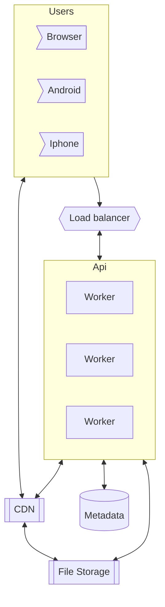

# Topic

"Youtube"

Video content sharing websites, though may look easy are complicated due to the size of their traffic. Even if the video upload side can be large, we need to consider that the video content, which is a large file, needs to be downloaded to the users.

The content service, must,

1. Provide video download
1. Allow seeking
1. Support many users downloading the same content (hotspots)

## Questions about scope and requirements

1. Who are my users? Humans
1. How will they use the service? Upload videos, watch videos.
1. Where will they watch? Apps, web browsers, Smart TV.
1. How many users? 5M DAU
1. Average daily time? 30 mins/user.
1. Video resolution? Most formats, and multiple resolutions.
1. Encryption? yes.
1. What is the average video size and length? 50mb, max 1GB
1. For how long do we need to store the video? Forever?
1. Can I use external services? (Storage?, CDN?) - yes
1. What should the video api expose?
   - get (video_id, location) -> storage link
   - upload (upload a video -> get id)
1. CAP
   - Consistency - eventual, any change (add,F edit, remove), would be eventually updated. BUT, a video must be edited at once.
   - Availability - we want to service always available.
   - Partitioning - we want the service to be tolerant against partitioning.

e.g. `AP`

1. Limitations - hardware, software, humans.

# Example

User Alice uploads a video to her channel
User Bob can download this video, starting at any point he likes. Can also download its metadata.

# High level design and considerations

Since we want to create an api, for youtube we must consider that these api calls may come from different devices. Even though the requests may come in the same form (say REST GET), we would be serving different data types for each consumer. e.g.

1. For android we may want to respond with .mpeg
1. For ios we may want ..
1. For we we may want ...

Not only that each of these responses may require different bit rates, for different networks or users. If we are on a metered mobile phone where bits cost, then we may want lower bit rate.

Lets consider,

## Formats, and bit rates

Each of the video files we are storing would have to have multiple formats, and multiple encodings for that format, to support multiple types of users.

Lets focus on 3 bit rates,

1. 480 b/s
1. 720 b/s
1. 1080 b/s "HD"

And 3 formats,

1. mpeg (30/1 compression)
1. mkv (H.264) - 500-2000/1 (take 500)
1. mov (h.264) - 500-2000/1 (take 500)

## Data

Lets calculate the system storage, given we are not deleting anything.

5e6 DAU,
