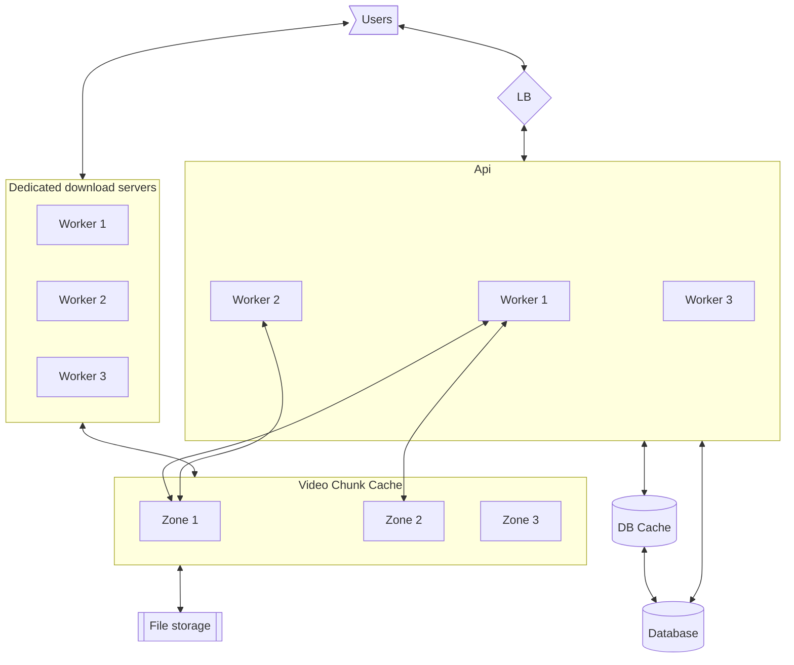

# Topic

"Youtube"

Video content sharing websites, though may look easy are complicated due to the size of their traffic. Even if the video upload side can be large, we need to consider that the video content, which is a large file, needs to be downloaded to the users.

The content service, must,

1. Provide video download
1. Allow seeking
1. Support many users downloading the same content (hotspots)

## Questions about scope and requirements

1. Who are my users? Humans
1. How many users? 5M DAU
1. What is the average video size and length? 50mb, max 1GB, 10 mins
1. Is there quality differences between the videos? Ignore for now.
1. How many (full) videos dose a user view in a day? 10
1. How many videos are uploaded (much smaller).. ignore.
1. What is the video format? Compress. Single.
1. For how long do we need to store the video? Forever?
1. How fast do we want to scroll, and start viewing a video? Almost immediately
1. Am I allowed to use existing infrastructure?
1. What should the video api expose?
   - start stream (video_id, location)
   - upload (upload a video -> get id)
1. CAP
   - Consistency - eventual, any change (add, edit, remove), would be eventually updated. BUT, a video must be edited at once.
   - Availability - we want to service always available.
   - Partitioning - we want the service to be tolerant against partitioning.

e.g. `AP`

1. Limitations - hardware, software, humans.

# Example

User Alice uploads a video to her channel
User Bob can download this video, starting at any point he likes. Can also download its metadata.

# High level, and considerations

Since we are developing a video streaming service, we would need the following parts,

1. Way to store the data.
1. A way to cache the data locally - close to the user - lower download time.
1. Metadata storage.
1. Save the data in chunks so we can seek it faster, and properly store it.
1. Download the videos locally, reducing network traffic between servers.
1. A way to handle hotspots - e.g. The data is consumed by a million users.

We would expect the data upload to be slow, since its on the user side (and we are uploading 1Gb of data).

## Goal

Create a service that,

1. Allows uploading of video by a user
1. Allows downloading of a video by multiple users.

## Video storage and seeking

Consider a very long video, one of 2hrs and 1GB of size. If we store this video as one file, at one location, it would be,

1. Hard to store and move this file for cache.
1. Hard to serve multiple users - a lot of users would be requesting a lot of data from one server.
1. Harder to seek it, (start at start, and go x bits)

On the other hand if we can store a video as video chunks, that is, the first x bytes, the second x bytes .. etc. We will be able to,

1. Spread the download around - multiple users at multiple positions of the video would be downloading from different servers.
1. We will be able to add more cache servers to the download - e.g. increase the workforce if load increases.
1. Fast seek (minute 12 -> chunk 12 -> +10 seconds/1 minute) is faster than minute 12, seek from 0.

## Video uploading

Since we are mostly watching (as compared to uploading), out upload service can be very slow. We consider that a video is uploaded when

1. All its chunks are uploaded to storage.
1. Its metadata is stored in the video database.
1. We can encode the video into serve encoding for better compatibility

Note that this allows for video replacement and versions, depending on the metadata structure.

## Data size

This is gonna be a lot of data. So we need to consider a way to store this data concurrently. I will assume (for now) that we have a way to store persistent files, which will be the chunks of the videos in a file service. This file service is gonna be much slower then we need, and we would need to create a cache repository.

Say we have 5M DAU, and ~1% of them are content creators, therefore (5e6\*1e-2) = 50000 content creators. If each one uploads a video every 10 days, with an average size of 100Mb, we would need to have 100e6\*5e4/10 = 50e10B or 500GB per day content (that is a lot). This would be the file storage requirements.

As for the metadata, we need to store,

1. The id.
1. Other info (creator, notifications, titles, views, etc..)
1. Data chunk ids (depending on size of chunk, but assuming 1mb chunks, ~50mb, so 50)

This would mean that the video metadata would be ~(20B+1kb+10B\*50) ~10kb per video max. With ~5e4 videos per 10 days, we would 5e4/10\*1e4 = 5e7B = 50mb per day. This is very little in comparison to the video storage size.

## So where is the load

### Upload

Since we know that the upload service can be slower and would require no cache, we can dump some of the upload load onto the file servers. Given a request to upload, we produce an upload token and provide a direct connection for the upload chunk. That would reduce load on the upload side but would require a custom uploader.

Another thing that can be done is to create special upload servers that chunk the data. This would be probably better for ease of use. These servers will perform the above task for the users without the need for the user to know about it. That also provides the ability us to create special content upload apps that would further reduce this upload and get us faster upload.

We may want to add a video encoding system to allow for better compatibility. This would require another service (or same update service) to store the video while we are processing it.

## Viewing (Download)

For this we must consider the data size. It is clear that we are downloading a lot more content then uploading it. Each user will be at a different time of the download and each download would be "unique" in that sense. That would mean lots of data and lots of servers. It clear that the service load is here.

In this case, we need to make sure we have the ability to spread this load on the different servers, and make sure this load is persistent to that server. Some back of the envelope,

1. Say each user watches 10 vids a day. On avg. 100mb
1. We have 10M DAU.
1. So we have 10e6*100e6*10 = 1e7*1e8*10 -> thats a wapping 1e16 bytes / day. or 1e16/1e5 = 1e11 bytes per second. Even spread across 1000 servers this is still a lot of data. It is clear that for this size of service we would need a lot of servers, and get us down to ~50mb per second. That said, since we can use cache services for interim storage, we can increase and decrease this number of servers with load.

We will though, have to use something like a DHT (Ring) - like redis, to allow us to serve so much data fast. We cannot though have the hope of storing this in memory, and would need fast disk to allow memory sharing of keys.

## Hotspots

We are clearly going to have videos that are more watched then others, this would mean that a certain chunks would require more cache slots then others (that is, we would expect a chunk to be loaded from different cache servers for different api streaming servers).

I will ignore this issue for now since its very complicated. We can discuss this as an improvement.

## Protocols

We can have two valid protocols that lots of apps can run (UDP and TCP).

When it comes to the browser, maybe its best not to use UPD since it would require custom players - and we don't require live stream where some packets can be ignored or skipped.

Since we do require the buffer to load, we would pick TCP. This may be different in the case of a live service, but even then, we can skip forward if needed to catch up with the live service.

## Com method

We can either use sockets, of chunk downloads.

1. For sockets (Websockets) - we must stream from the same server and keep the socket alive. Our download would be tied to one server and if the server fails we are bust. Though, this method may be required for some video services and applications. We will call this the dedicated download service.

1. For web clients, we can generate our own client which will download 1mb chunks from a service, and seek these chunks on its side. Thus allowing us to create a download that is not server dependent and thus spread the load on all of our servers.

# So far,

1. We have described a service that can upload videos
1. We described two methods to download videos.
1. We described a method to store videos.

# Design

At very high level, we have the following services,

1. File service - stores chunks persistently
1. Database - (lets use redis again) - Config and metadata for videos. Other entities.
1. Cache service - stores chunks for download via the api, and has multiple replication of the chunks in different zones.
1. API - upload and download services.
1. API - load balancer

So in general,



## API

The api uploads and download servers, since this service is stateless, we can increase its size according to the system load.

### Upload

Slow and will create a video

1. Upload start from user
1. Create video id, metadata, and generate chunk storage locations.
1. For each chunk in the upload, (can be parallel)
   - create a new chunk metadata and storage id (uuid? hash? - hash is better so we wont write twice)
   - upload to the file service.
1. Update the metadata for the chunks in the video.
1. Update a reverse lookup, chunks -> video.
1. If needed, mark the file as pending before being scanned for security and offensive content. Only once approved it can go online.
1. Return ok.

Cleanup; when a chunk is not needed by any video service it should be cleaned up. For this we would need a last accessed. This can be provided by the file storage system, and if a chunk was not accessed for very long it can be,

1. Moved to slower archive.
1. Checked if still needed.
1. Deleted if not needed.

This would require a background service.

### Download

Should be must faster,

Out api, not dedicated servers,

1. User request video id, seek location.
1. Get the video metadata from the db cache service.
1. If chunk download, start downloading according to chunk that matches the seek position. Notify the client
1. If websocket open (or other protocol), provide token and ip of dedicated download server, to use when downloading.

## Cache

Its important that our cache service would have replicas of hotspot files in each zone of the service. In Meta this is created by Owl, and we can use this service as our caching service to download files. If we cannot, one can think of a DHT Ring (like redis) where the keys are generated more than once.

To make sure we are tracking the cache usage, we can track the amount of times a chunk has been downloaded, and the rate of chunk access, thus providing metrics on current hotspots.

## Chunk storage

Delegated to a file storage server.

# Fault tolerance

The most important thing we have is the to make sure we do not lose the video data. This would mean our config database, needs to be eventually consistent. Otherwise, if we fail to upload or download we should be ok.

# Performance, Scalability and Availability

The API and Video Chunk cache are stateless, and therefore can be expanded or contracted according to use. They also can be horizontally scalable.

API downloads, if direct, would increase the load on each of the api servers, that can be dealt with in the load balancer. Each chunk call can be done on its own, and therefore spread the load around. As performance go, they will download from the cache servers which are local to them, and therefore will result in faster donwload. We can also imagine a case where the most "local" cache server ip is given to the user, and the user will download from there.

Dedicated download servers, are different though, and would expand with respect to the number of active users. Since a user takes a "spot" on a server, if the server fails, the user would need to reconnect and restart the load. This may be slower.

# Monitoring

1. The size of the database
1. The traffic size
1. Direct downloads and download size.
1. Storage size.
1. Worker load.

```

```
